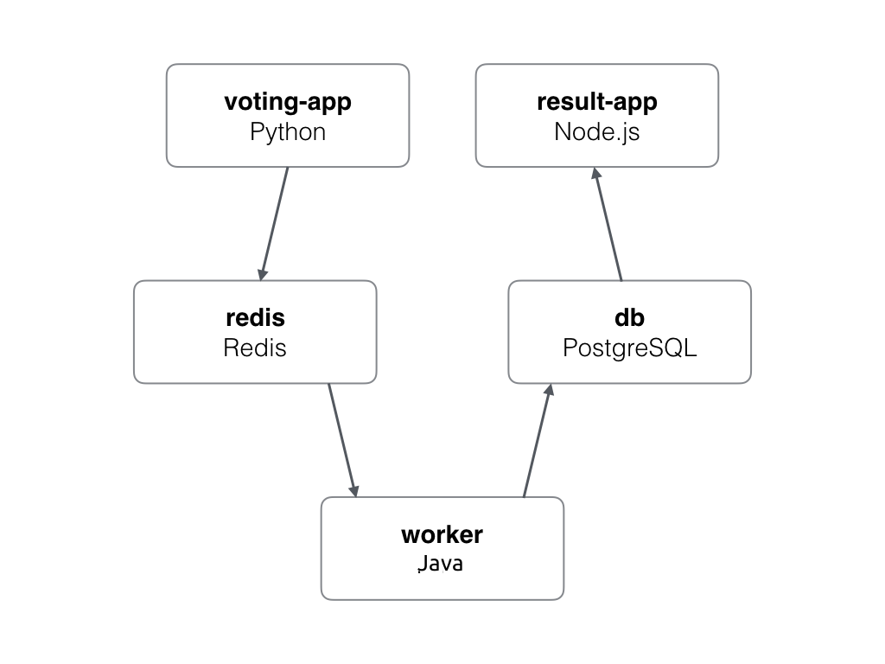

# Kubernetes : Voting App

The aim of this project is to deploy an example voting app on an Openshift or Kubernetes cluster.

## Description

This repository is forked from that [repository](https://github.com/dockersamples/example-voting-app).

The voting app is based on that architecture :

*   A Python webapp which lets you vote between two options
*   A Redis queue which collects new votes
*   A Java worker which consumes votes and stores them in…
*   A Postgres database backed by a Docker volume
*   A Node.js webapp which shows the results of the voting in real time

The architecture can be schematized like this :



Be aware that the voting application only accepts one vote per client. It does not register votes if a vote has already been submitted from a client.

### Objectives

The main objective of this repository is to demonstrate how to manage different objects of different platform like Kubernetes and Openshift by simply manage an application based on the Docker example voting app.

To do that, some principles have been respected :

*   Replication : Each services are deployed in a way that they can be easily replicate on each node at any time.
*   Security : The sensitive data are encoded and manage by secrets. The network communication between pods are restricted to the minimum required.
*   Persistency : Some data are persisted on volumes that cannot be deleted to ensure that they can be remounted on demand.
*   Autoscaling : Based on simple metrics, some services can be auto scale on the cluster if it's needed.
*   Monitoring : Each services are monitored by healthchecks to ensure the stability of the application.
*   CloudNative : The application can use some cloud object like volumes for data persistency.
*   HighAvailability :Each services are deployed with the best practices of each plateform to ensure the high availability of the application.
*   Elasticity : Based on simple metrics, some services can request more resources to be more efficient.
*   Resource Management: To be able to manage the elasticity and the auto scaling principles, the resources are limited to ensure the cluster health.

## Getting Started

These instructions will get you a copy of the project up and running on your cluster for development and testing purposes.

### Prerequisites

What things you need to deploy this app :

*   You need to provision the cluster on which you want to deploy the app
*   You need to be able to management your cluster with the command line (kubectl, oc, docker)

## Kubernetes Usage

The folder kubernetes contains the YAML definition files of the Voting App's services.

### Deployment

The deployment of the application can be done by CLI or by the Kubernetes Dashboard. Deploying by Web console required a lot of steps to deploy every part of the application.

The deployment by CLI need only one command to deploy everything on Kubernetes and the return should look like this :

```bash
$ kubectl apply -f kubernetes/kubectl-yaml/
namespace "voting-app-prd" created
deployment.apps "db" created
networkpolicy.networking.k8s.io "db" created
persistentvolumeclaim "db" created
secret "db" created
service "db" created
limitrange "voting" created
networkpolicy.networking.k8s.io "default-deny-ingress" created
networkpolicy.networking.k8s.io "default-allow-egress" created
resourcequota "voting" created
deployment.apps "redis" created
networkpolicy.networking.k8s.io "redis" created
persistentvolumeclaim "redis" created
secret "redis" created
service "redis" created
deployment.apps "result" created
horizontalpodautoscaler.autoscaling "result" created
networkpolicy.networking.k8s.io "result" created
service "result" created
configmap "vote" created
deployment.apps "vote" created
horizontalpodautoscaler.autoscaling "vote" created
networkpolicy.networking.k8s.io "vote" created
service "vote" created
deployment.apps "worker" created
horizontalpodautoscaler.autoscaling "worker" created
```

[](https://asciinema.org/a/99kp2nIvxyqtK5EUoTRFJ6h1P)

If everything run as expected, the vote and result Web interface should be respectively accessible on port 31000 and 31001 on each worker node IP address.

It is recommended to configure a load balancer to easily distribute each application by a unique DNS name.

### Deletion

There is two level of deletion : object and namespace

#### Object

Sometimes it could be useful to delete a specific object to be able to recreate it with some new features that cannot be directly upgraded.

The deletion of a specific object in the namesapce can be done by the Web console or by the CLI combine with the YAML file definition of the specific object.

For example, to delete the result app service defined in the file kubernetes/result-service.yaml, the deletion command should be :

```bash
$ kubectl delete -f kubernetes/kubectl-yaml/result-service.yaml
service "result" deleted
```

[](https://asciinema.org/a/aaBZXMnExoNsa3Pjd2A3Amgzm)

#### Namespace

The deletion of each object deployed can be done easily by deleting the namespace directly. Kubernetes will then delete each object referenced in that namespace.

This action can be done by the Web console or by CLI.

To delete the namespace, run this command :

```bash
$ kubectl delete namespace WORKSPACE_NAME
```

[](https://asciinema.org/a/cxKDhVanlpJHRAhHKHO90TiOE)

## Openshift Usage

The folder openshift contains the YAML definition files of the Voting App's services.

### Deployment

The deployment of the application can be done by CLI or by the Openshift Web console. Deploying by Web console required a lot of steps to deploy every part of the application.

The deployment by CLI need only one command to deploy everything on Openshift and the return should look like this :

```bash
$ oc apply -f openshift/oc-yaml/
project.project.openshift.io "voting-app-prd" created
deploymentconfig.apps.openshift.io "db" created
networkpolicy.networking.k8s.io "db" created
persistentvolumeclaim "db" created
secret "db" created
service "db" created
limitrange "voting" created
networkpolicy.networking.k8s.io "default-deny-ingress" created
networkpolicy.networking.k8s.io "default-allow-egress" created
resourcequota "voting" created
secret "gitlab" created
deploymentconfig.apps.openshift.io "redis" created
networkpolicy.networking.k8s.io "redis" created
persistentvolumeclaim "redis" created
secret "redis" created
service "redis" created
buildconfig.build.openshift.io "result" created
deploymentconfig.apps.openshift.io "result" created
horizontalpodautoscaler.autoscaling "result" created
imagestream.image.openshift.io "result" created
networkpolicy.networking.k8s.io "result" created
secret "gitlab-result" created
service "result" created
buildconfig.build.openshift.io "vote" created
configmap "vote" created
deploymentconfig.apps.openshift.io "vote" created
horizontalpodautoscaler.autoscaling "vote" created
imagestream.image.openshift.io "vote" created
networkpolicy.networking.k8s.io "vote" created
secret "gitlab-vote" created
service "vote" created
buildconfig.build.openshift.io "worker" created
deploymentconfig.apps.openshift.io "worker" created
horizontalpodautoscaler.autoscaling "worker" created
imagestream.image.openshift.io "worker" created
secret "gitlab-worker" created
```

[](https://asciinema.org/a/R8Ctu0xyFnAtezWx5LngilS8e)

If everything run as expected, the vote and result Web interface should be respectively accessible on port 31000 and 31001 on each worker node IP address.

It is recommended to configure a load balancer to easily distribute each application by a unique DNS name.

### Deletion

There is two level of deletion : object and project

#### Object

Sometimes it could be useful to delete a specific object to be able to recreate it with some new features that cannot be directly upgraded.

The deletion of a specific object in the project can be done by the Web console or by the CLI combine with the YAML file definition of the specific object.

For example, to delete the result app service defined in the file openshift/result-service.yaml, the deletion command should be :

```bash
$ oc delete -f openshift/oc-yaml/result-service.yaml
service "result" deleted
```

[](https://asciinema.org/a/sZdTYCJBn0Op6hM5bToM7jrUE)

#### Project

The deletion of each object deployed can be done easily by deleting the project directly. Openshift will then delete each object referenced in that project.

This action can be done by the Web console or by CLI.

To delete the project, run this command :

```bash
$ oc delete project PROJECT_NAME
project.project.openshift.io "voting-app-prd" deleted
```

[](https://asciinema.org/a/kikEh2QZJZwumJzlx84IL0VPx)

## Helm Usage

Helm is the first application package manager running atop Kubernetes. It allows describing the application structure through convenient helm-charts and managing it with simple commands. Helm is a huge shift in the way the server-side applications are defined, stored and managed. Adoption of Helm might well be the key to mass adoption of microservices, as using this package manager simplifies their management greatly.

A Helm chart encapsulates each of YAML definitions, provides a mechanism for configuration at deploy-time and allows to define metadata and documentation that might be useful when sharing the package.

### Prerequisites

What things you need to deploy this app with Helm :

*   The Tiller (Helm server side) has to be ready
*   Helm has to be installed on the control host which gonna run the command line
*   Each service of the application has to be packaged, this should already be done

### Deployment

Helm is easy to use and has the advantage to allow to modify some default values of the charts to easily configure each service on different environments.

Independently of the orchestrator used, the command line structure to deploy the chart gonna be the same. Depending on the orchestrator used, the charts should be different :

*   To deploy on Openshift, use the charts : openshift/helm-charts
*   To deploy on Kubernetes, use the charts : kubernetes/helm-charts

To deploy the charts on the orchestrator thanks to Helm, this command has to be adapt and run on a computer which have access to the cluster :

```
$ helm install -n APP_NAME PATH_TO_CHARTS
```

For example, to deploy the application on an Openshift cluster, this command should be used :

```
$ helm install -n voting-app openshift/helm-charts/
```

If everything run as expected, the vote and result Web interface should be respectively accessible on port 31000 and 31001 on each worker node IP address.

It is recommended to configure a load balancer to easily distribute each application by a unique DNS name.

### Deletion

Helm can manage the life cycle of an application creation, upgrade and deletion.

To delete an application deployed by Helm, a simple command is needed :

```
$ helm delete --purge APP_NAME
```

For exampe, to delete the installation of the application on an Openshift cluster, the command should be :

```
$ helm delete --purge voting-app
```

This command gonna delete everything on the Openshift cluster and remove the deployment history in Helm.

## Ansible Usage

Ansible is a simple IT automation engine that automates cloud provisioning, configuration management, application deployment, intra-service orchestration, and many other IT needs.

An Ansible playbook has been developed to be able to manage the deployment of the application on Kubernetes or Openshift clusters.

### Prerequisites

What things you need to deploy this app with Helm :

*   Install Ansible on the control host to be able to run the playbook
*   The control host has to have access to the remote cluster by SSH
*   Configure the host file depending on your cluster

### Deployment

Ansible can manage the life cycle of an application creation, upgrade and deletion. Each operations are based on the API of each cluster.

To deploy the application, make sure that the global "state" parameter is set to "present" in the group_vars file.

```bash
[...]

# Manage installation or uninstallation
app_state: present

[...]
```

When it's done, the playbook can be execute to deploy the application on the remote cluster :

```bash
$ ansible-playbook voting.yml
[...]
Friday 14 September 2018  15:55:44 -0400 (0:00:00.012)       0:00:03.084 ******
===============================================================================
voting/namespace : VOTING APP NAMESPACE | Manage workspace ---------------------------------------------------------------------------------------------------------------------------------------------------------------------------- 0.66s
voting/namespace : VOTING APP NAMESPACE | Manage Resource Quotas ---------------------------------------------------------------------------------------------------------------------------------------------------------------------- 0.56s
voting/namespace : VOTING APP NAMESPACE | Manage LimitRange --------------------------------------------------------------------------------------------------------------------------------------------------------------------------- 0.56s
voting/namespace : VOTING APP NAMESPACE | Manage NetworkPolicy ------------------------------------------------------------------------------------------------------------------------------------------------------------------------ 0.55s
voting/postgresql : VOTING APP DATABASE | Manage Deployment --------------------------------------------------------------------------------------------------------------------------------------------------------------------------- 0.07s
voting/worker : VOTING APP WORKER | Manage Horizontal Pod Autoscaling ----------------------------------------------------------------------------------------------------------------------------------------------------------------- 0.04s
voting/vote : VOTING APP VOTE | Manage Service ---------------------------------------------------------------------------------------------------------------------------------------------------------------------------------------- 0.04s
voting/postgresql : VOTING APP DATABASE | Manage Service ------------------------------------------------------------------------------------------------------------------------------------------------------------------------------ 0.04s
voting/postgresql : VOTING APP DATABASE | Manage Secret ------------------------------------------------------------------------------------------------------------------------------------------------------------------------------- 0.04s
voting/redis : VOTING APP REDIS | Manage Volume persistency --------------------------------------------------------------------------------------------------------------------------------------------------------------------------- 0.04s
voting/redis : VOTING APP REDIS | Manage Service -------------------------------------------------------------------------------------------------------------------------------------------------------------------------------------- 0.04s
voting/result : VOTING APP RESULT | Manage Service ------------------------------------------------------------------------------------------------------------------------------------------------------------------------------------ 0.03s
voting/postgresql : VOTING APP DATABASE | Manage Volume persistency ------------------------------------------------------------------------------------------------------------------------------------------------------------------- 0.03s
voting/vote : VOTING APP VOTE | Manage Horizontal Pod Autoscaling --------------------------------------------------------------------------------------------------------------------------------------------------------------------- 0.03s
voting/vote : VOTING APP VOTE | Manage Config Map ------------------------------------------------------------------------------------------------------------------------------------------------------------------------------------- 0.03s
voting/redis : VOTING APP REDIS | Manage Secret --------------------------------------------------------------------------------------------------------------------------------------------------------------------------------------- 0.03s
voting/result : VOTING APP RESULT | Manage Horizontal Pod Autoscaling ----------------------------------------------------------------------------------------------------------------------------------------------------------------- 0.03s
voting/redis : VOTING APP REDIS | Manage Deployment ----------------------------------------------------------------------------------------------------------------------------------------------------------------------------------- 0.03s
voting/vote : VOTING APP VOTE | Manage Deployment ------------------------------------------------------------------------------------------------------------------------------------------------------------------------------------- 0.03s
voting/result : VOTING APP RESULT | Manage Deployment --------------------------------------------------------------------------------------------------------------------------------------------------------------------------------- 0.03s
```

### Deletion

To delete an application deployed by Ansible, a parameter has to be updated before running the playbook.

The parameter "state" is in the group_vars file and has to be changed to "absent" :

```bash
[...]

# Manage installation or uninstallation
app_state: absent

[...]
```

When it's done, the playbook can be execute to delete the project or namespace and each object in it :

```
$ ansible-playbook voting.yml
```

## Author

Member of Wikitops : https://www.wikitops.io/

## Licence

This project is licensed under the Apache License, Version 2.0. For the full text of the license, see the LICENSE file.
